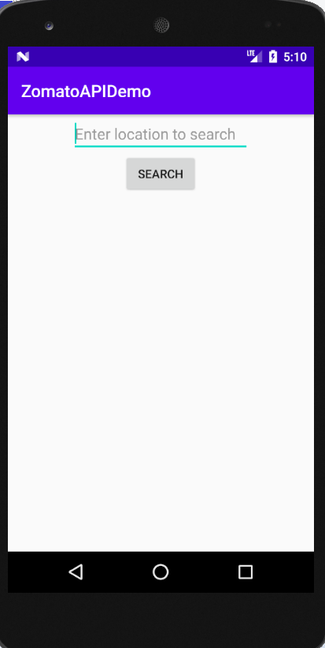
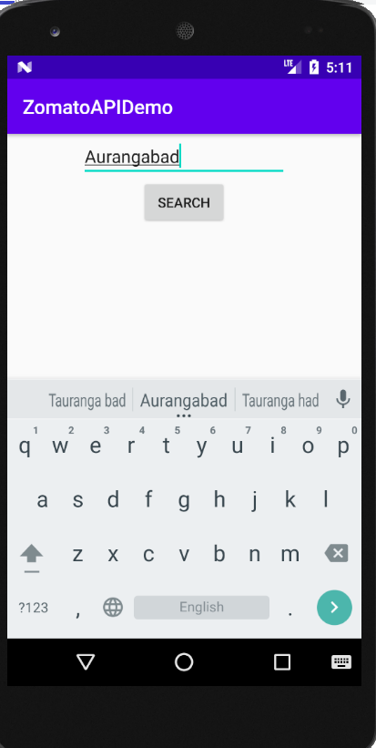
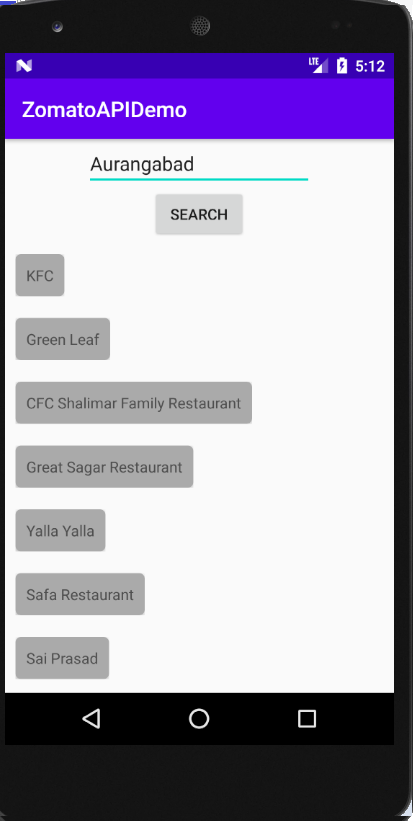

<h1 align="center">Yue SHG App</h1> 

:eyeglasses: Yue App for Self Help Groups

 

  
  

 

 

**Zomato API Demo App** searches the restaurants in the entered city.

Uses Retrofit for making API calls and MVVM architecture for better code management.

## Contents

- [Demo](#demo)
- [Codebase Focus](#codebase-focus)
- [Use Case](#use-case)
- [Technologies used](#technologies-used)

## Codebase Focus

Codebase focuses 👓 on following key things:
- MVVM
- Retrofit for network calls
- Gson for parsing the JSON response
- Coroutines for running network tasks in background
- Reactive UIs using LiveData

## Use Case

User can find the restaurants in the desired city.

## Demo 

### City search

	 
    </img>
    </img>
    </img>

## Technologies used:

* [Retrofit](https://square.github.io/retrofit/) a REST Client for Android which makes it relatively easy to retrieve and upload JSON (or other structured data) via a REST based webservice.
* [ViewModel](https://developer.android.com/topic/libraries/architecture/viewmodel) to store and manage UI-related data in a lifecycle conscious way.
* [LiveData](https://developer.android.com/topic/libraries/architecture/livedata) to handle data in a lifecycle-aware fashion.
* [Coroutines](https://kotlinlang.org/docs/reference/coroutines-overview.html) used to manage the heavy operations i.e. `making network calls`. Coroutines help in managing background threads and reduces the need for callbacks.

## Installation

Clone the repository. Open in Android Studio. Sync Gradle and Run.

## :computer: Thank You